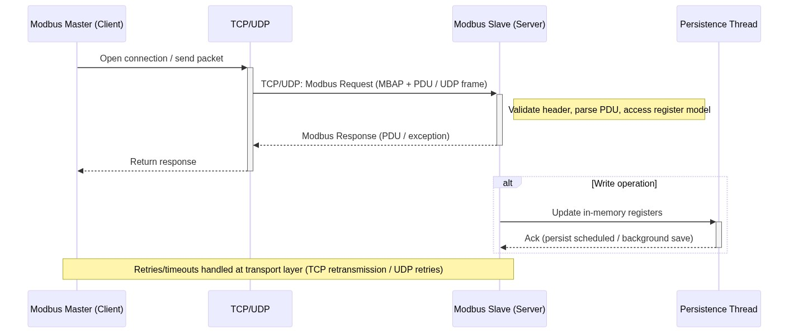

# arc42 Architecture Documentation for Modbus TCP Server

This document follows the arc42 template and maps the project's repository to the arc42 sections.

**1. Introduction and Goals**
- **Purpose:** Provide a mock Modbus TCP/UDP server for testing Modbus masters and for use in CI.
- **Key stakeholders:** Test engineers, integrators, maintainers.
- **Main goals:** reliable Modbus protocol emulation, configurable registers via JSON, optional TLS, simple persistence.

**2. Constraints**
- **Language/runtime:** Python 3.10–3.12 (see `src/requirements.txt`).
- **Ports:** Default Modbus listening port is 5020 (TCP/UDP).
- **Environment:** Runs in container (Dockerfiles present) and as a standalone script.

**3. Context and Scope**
- **System Context:** The server listens for Modbus clients over TCP/UDP (and optionally TLS). It exposes configured registers and supports persistence to a JSON file.
- **External systems:** Modbus clients, Docker host, optional TLS clients.

**4. Solution Strategy**
- Use a compact Python server implemented in `src/app/modbus_server.py`.
- Configuration-driven: initial registers and behavior from JSON files in `examples/` or `src/app/modbus_server.json`.
- Persistence handled by a lightweight JSON persistence layer under `src/app/lib/register_persistence`.

**5. Building Block View (Static Structure)**
- **Entry point:** `src/app/modbus_server.py` — server startup, config parsing, logging.
- **Persistence module:** `src/app/lib/register_persistence/__init__.py` — save/load register state.
- **Configuration files:** `src/app/modbus_server.json`, `examples/*.json` — register definitions.
- **Tests:** `tests/test_server.py`, `tests/test_utils.py`, `tests/test_register_persistence.py` — unit tests and examples.
- **Dependencies:** `src/requirements.txt` (project dependencies used at runtime and in tests).

**6. Runtime View (Key Scenarios)**
- **Start server:** `modbus_server.py` reads config, prepares Modbus data blocks, optionally loads persistence, starts listening on configured interfaces.
- **Register access:** Incoming Modbus requests are served from in-memory data blocks; write operations update in-memory state and (optionally) trigger persistence.
- **Persistence loop:** Background thread periodically saves register state to `/data/modbus_registers.json` (or configured path).

**7. Deployment View**
- **Container image:** `Dockerfile` and `Dockerfile.test` provide containerized deployment with pinned Python runtime.
- **Ports:** Expose 5020/tcp and 5020/udp by default.
- **Volumes:** Recommended mount for persistence: host path → `/data` inside container to retain `modbus_registers.json`.

**8. Cross-cutting Concepts**
- **Configuration:** JSON-driven; register numbers are JSON string keys; values can be booleans (bit registers) or hex/integer for word registers (see docs in repo).
- **Logging:** Module-level logging configured in `modbus_server.py`.
- **Security:** Optional TLS support (configuration-controlled). When deployed in untrusted networks, run behind appropriate network controls.

**9. Architecture Decisions (ADRs) — short list**
- Use JSON for register configuration: simple, human-editable, easy to mount into containers.
- Provide both TCP and UDP Modbus endpoints for maximal compatibility with test scenarios.

**10. Quality Requirements**
- **Availability:** Server must start reliably and gracefully handle shutdowns (server already implements graceful shutdown logging).
- **Performance:** Designed for low-to-medium throughput testing scenarios (not a production-grade high-performance Modbus gateway).
- **Maintainability:** Small code base, test coverage in `tests/` directory.

**11. Risks & Technical Debt**
- Single-threaded request handling or dependency limitations could limit concurrency; evaluate if high-load testing is required.
- Persistence format is JSON; binary/large-scale persistence not optimized.

**12. Mapping: Files → arc42 Sections**
- **Startup & runtime behavior:** `src/app/modbus_server.py` → sections 4, 5, 6.
- **Persistence implementation:** `src/app/lib/register_persistence/__init__.py` → sections 5, 6, 8.
- **Configuration/examples:** `src/app/modbus_server.json`, `examples/*.json` → sections 3, 4.
- **Tests & verification:** `tests/*` → section 10 (quality requirements and validation).
- **Containerization:** `Dockerfile`, `Dockerfile.test` → section 7.

**13. Next Steps & Suggestions**
- Create ADRs for TLS choices and persistence path conventions.
- Expand Building Block diagrams (drawn diagrams) and runtime sequence diagrams for main scenarios.
- Add explicit security section describing TLS cert management and required firewall rules.

**Diagrams**
**Modbus Master-Slave Communication Sequence**

---
Generated by project maintainer guidance — review and refine details for project-specific decisions.
